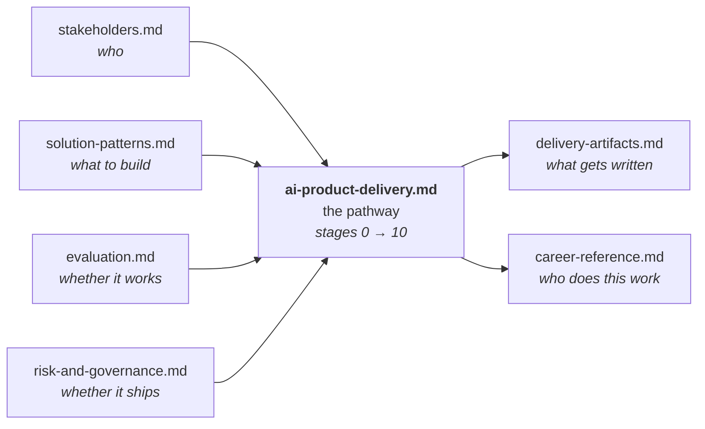

# Career

A working reference on **how AI products actually get delivered** — from the
moment someone says "could AI do this?" to the day the system is running in
production with someone accountable for it at 3am.

This folder is documentation, not code. It exists because most AI material
explains *models* and almost none explains *delivery*: the stages, the gates,
the people in the room, the artifacts that have to exist before anyone signs
off, and the specific ways AI projects die that traditional software projects
do not.

---

## What's here

| Document | What it covers |
|---|---|
| **[ai-product-delivery.md](ai-product-delivery.md)** | The core pathway. Eleven stages from intake to decommission, each with entry conditions, activities, artifacts, owners, exit gates, and failure modes. |
| **[stakeholders.md](stakeholders.md)** | Everyone involved in an enterprise AI build, what each of them actually wants, what they will block on, and how the same result gets described differently to each. |
| **[solution-patterns.md](solution-patterns.md)** | The architecture decision layer. Prompt vs RAG vs fine-tune vs agent vs classical ML — with the questions that select between them and the cost of choosing wrong. |
| **[evaluation.md](evaluation.md)** | How AI systems are measured. Offline evals, golden datasets, RAGAS, LLM-as-judge, online metrics, and the diagnostic logic that turns a bad score into a specific fix. |
| **[risk-and-governance.md](risk-and-governance.md)** | Security, compliance, guardrails, human-in-the-loop, audit trails, prompt injection, PII, and the review boards that gate enterprise deployment. |
| **[delivery-artifacts.md](delivery-artifacts.md)** | The paper trail. Every document a delivery produces, in template form — one-pagers, solution designs, eval reports, runbooks, model cards. |
| **[career-reference.md](career-reference.md)** | Role definitions in the applied-AI market, what separates adjacent titles, the skills with the longest half-life, and how the delivery pathway maps onto them. |

---

## How the documents relate

The pathway is the spine. The other five are the disciplines it depends on, and
`delivery-artifacts.md` is what falls out the other end.

---

## The one-paragraph version

An AI product is a normal software product with three unusual properties: its
core component is **non-deterministic**, its quality is **statistical rather than
binary**, and its failure mode is **confident wrongness rather than a crash**.
Every stage in the pathway is a response to one of those three. Discovery
insists on a measurable definition of "working" because "working" is not
self-evident. Evaluation exists as its own discipline because tests that pass or
fail cannot describe a system that is right 87% of the time. Governance is
heavier than in conventional software because a wrong answer delivered fluently
is more dangerous than an error page. Everything else is ordinary engineering.

---

## Conventions used in these documents

- **Stage** — a phase of delivery with a defined exit gate. Stages are sequential;
  work inside them is not.
- **Gate** — a decision point where someone with authority says continue, revise,
  or stop. A stage that cannot be exited is not "in progress", it is blocked.
- **Artifact** — a durable output (document, dataset, dashboard, running service).
  If a stage produces no artifact, it did not happen.
- **PoC / pilot / production** — three distinct commitments, defined in
  [ai-product-delivery.md](ai-product-delivery.md#poc-vs-pilot-vs-production).
  Conflating them is the single most common cause of an AI project collapsing at
  handover.
