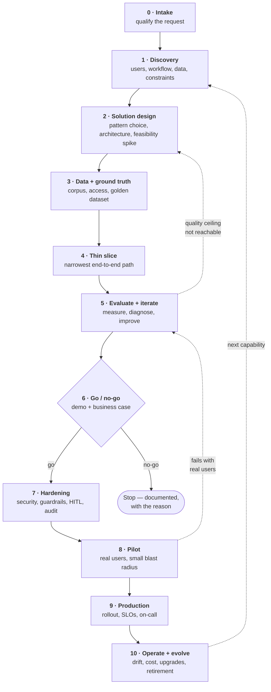
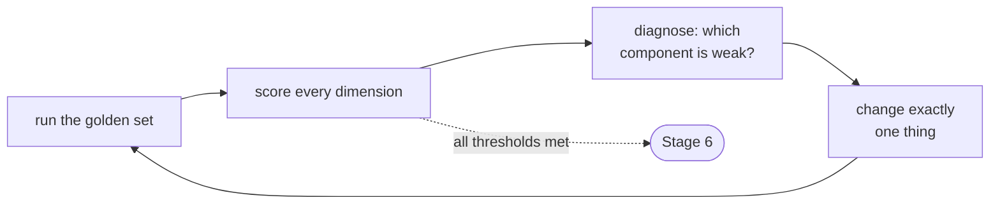

# AI Product Delivery — The Complete Pathway

**Stage 0 to decommission.** What happens at each stage, who is in the room,
what has to exist before the next stage can start, and how each stage typically
fails.

This is written for the engineer who is expected to own an AI deliverable end to
end — the person who takes a vague business request and returns a running,
measured, defensible system. In consulting and enterprise settings that role is
called an AI Engineer, Applied AI Engineer, Solutions Engineer, or
Forward-Deployed Engineer; the pathway is the same regardless of the title on
the badge.

---

## Contents

- [The shape of the whole thing](#the-shape-of-the-whole-thing)
- [PoC vs pilot vs production](#poc-vs-pilot-vs-production)
- [Stage 0 — Intake and qualification](#stage-0--intake-and-qualification)
- [Stage 1 — Discovery](#stage-1--discovery)
- [Stage 2 — Solution design and feasibility](#stage-2--solution-design-and-feasibility)
- [Stage 3 — Data and ground truth](#stage-3--data-and-ground-truth)
- [Stage 4 — Build the thin slice](#stage-4--build-the-thin-slice)
- [Stage 5 — Evaluate and iterate](#stage-5--evaluate-and-iterate)
- [Stage 6 — Demo and the go/no-go gate](#stage-6--demo-and-the-gono-go-gate)
- [Stage 7 — Hardening](#stage-7--hardening)
- [Stage 8 — Pilot](#stage-8--pilot)
- [Stage 9 — Production and scale](#stage-9--production-and-scale)
- [Stage 10 — Operate, evolve, retire](#stage-10--operate-evolve-retire)
- [The gate table](#the-gate-table)
- [Cross-cutting concerns](#cross-cutting-concerns)
- [How deliveries actually fail](#how-deliveries-actually-fail)

---

## The shape of the whole thing

Solid arrows are the happy path. Dotted arrows are the loops that make this an
AI delivery rather than a software delivery: quality is discovered, not
specified, so returning to an earlier stage is a normal outcome and not a
failure.

**Two rules govern the whole diagram.**

1. **The evaluation harness is built before the thing it evaluates.** Stage 3
   produces the golden dataset; Stage 4 produces the system. A team that builds
   in the other order has no way to know whether any subsequent change helped.
2. **Every stage exits through a gate owned by a named person.** Not a team, not
   a channel — a person. Unowned gates are how projects spend six weeks in
   "almost done".

---

## PoC vs pilot vs production

These three words are used interchangeably in conversation and mean completely
different commitments. Getting the distinction into writing at Stage 0 prevents
the most expensive failure in AI consulting: a demo being mistaken for a
product.

| | **Prototype** | **PoC** | **Pilot** | **Production** |
|---|---|---|---|---|
| **Question it answers** | "What would this feel like?" | "Is this technically achievable on real data?" | "Does this work for real users in their real workflow?" | "Can this run indefinitely at scale?" |
| **Data** | fake or hand-picked | real, scoped subset | real, live | real, all of it |
| **Users** | none | none (stakeholders watch) | a small named group | everyone in scope |
| **Quality bar** | looks plausible | measurably clears a defined threshold | acceptable to real users | meets an SLO |
| **Non-functionals** | ignored | mostly ignored, latency noted | security, audit, HITL required | full: SLO, DR, on-call, cost controls |
| **Lifespan** | days | weeks | 1–3 months | years |
| **Typical outcome** | direction chosen | go/no-go decision | scope and ROI confirmed | ongoing operation |

The dangerous transition is **PoC → pilot**, because it is the point at which
everything deliberately skipped becomes mandatory: authentication, tenant
isolation, audit logging, rate limiting, error handling, cost caps, and a human
who is accountable when the system is wrong. A PoC that took three weeks
routinely takes another eight to become a pilot. Saying that number out loud at
Stage 6 is the difference between a credible plan and a broken promise.

---

## Stage 0 — Intake and qualification

**Purpose.** Decide whether this request deserves any engineering time at all,
and translate it out of buzzwords into a problem statement.

Requests arrive as solutions, not problems: *"we want an AI chatbot for our
policy documents"*, *"can we put an agent on our ticketing system"*. Stage 0
converts that into a sentence of the form:

> **[Who]** currently spends **[effort]** doing **[task]**, which costs
> **[money / risk / delay]**, because **[root cause]**.

If that sentence cannot be completed with real numbers, the project is not ready
and no amount of model selection will fix it.

### The qualification questions

**Problem**
- What does the person do today, step by step, without any AI?
- How many times per day/week does this happen, and how long does each take?
- What is the cost of the current approach — salary hours, error rate, delay,
  regulatory exposure, customer churn?
- What happens if nothing is built? (If the honest answer is "nothing", stop.)

**Fit**
- Is the task **language-shaped** — reading, writing, summarising, extracting,
  classifying, conversing? If it is arithmetic, lookup, or rules over structured
  data, conventional software or classical ML is cheaper, faster, and more
  reliable. See [solution-patterns.md](solution-patterns.md#when-not-to-use-an-llm).
- Is there **tolerance for being wrong**? A system that is right 90% of the time
  is transformative for draft generation and unusable for payroll.
- Does a **human already review** this output, or could one? Human-in-the-loop
  converts an unacceptable error rate into an acceptable one.

**Feasibility signals**
- Does the data that would be needed **exist**, and does anyone know where?
- Is it **accessible** — legally, contractually, technically?
- Is there a **person who can say what a good answer looks like**? Without a
  domain expert willing to spend hours labelling, evaluation is impossible.

**Commercial**
- Who owns the budget, and is it allocated or aspirational?
- Who is the executive sponsor — the person whose year gets worse if this fails?
- Is there a deadline attached to an external event (audit, contract renewal,
  board meeting)? Those deadlines do not move.

### Kill criteria

Writing down the conditions under which the project should be stopped, at the
moment everyone is enthusiastic, is what makes stopping possible later. Typical
ones: required data turns out to be inaccessible; the domain expert cannot be
freed up; the accuracy ceiling on a representative sample lands below the
threshold the business needs; unit cost per transaction exceeds the value of the
transaction.

| | |
|---|---|
| **Entry** | A request from a business stakeholder. |
| **Activities** | Interviews, cost-of-status-quo estimate, fit assessment, kill-criteria definition. |
| **Artifacts** | One-page problem statement · success hypothesis · kill criteria · named sponsor. |
| **Stakeholders** | Business sponsor, domain lead, delivery lead. Engineering is consulted, not yet committed. |
| **Exit gate** | The sponsor agrees the written problem statement is the problem, and funds discovery. |
| **Duration** | Days. |

### How Stage 0 fails

- **Solution-first framing goes unchallenged.** The team builds the chatbot that
  was asked for instead of the search improvement that was needed.
- **No sponsor.** An enthusiastic middle manager is not a sponsor. Projects
  without budget authority die at Stage 6 regardless of quality.
- **The domain expert is assumed.** Every AI project needs someone who can say
  "that answer is wrong, and here is why". If nobody is assigned, evaluation
  silently becomes the engineer's opinion.

---

## Stage 1 — Discovery

**Purpose.** Replace assumptions with observations. Discovery is the stage that
determines whether the eventual system fits the way people actually work.

### Users and workflow

Build the **as-is workflow** as a literal step list, observed rather than
described — what people say they do and what they do differ. For each step,
record: who does it, what they open, what they type, how long it takes, what
goes wrong, and what they do when it goes wrong.

Then build the **to-be workflow** showing exactly where the system sits. Three
questions determine the entire product design:

1. **Where does the output land?** In a chat window nobody has open, or inside
   the CRM screen the user already lives in? Adoption is decided here more often
   than by quality.
2. **Who checks it?** Fully automated, human-approves-before-action, or
   human-does-the-work-with-assistance. This is the single largest driver of the
   quality bar.
3. **What happens when it is wrong?** If the answer is "the user notices and
   ignores it", the risk profile is mild. If it is "an incorrect refund is
   issued", the system needs approval steps and audit trails from day one.

### Personas

A persona here is operational, not marketing: role, technical comfort, time
pressure, volume of tasks per day, tolerance for latency, device and
environment, and what they will do the first time the system embarrasses them in
front of a customer.

### Data inventory

For every source that might feed the system:

| Question | Why it matters |
|---|---|
| Where does it live? | SharePoint, Confluence, a shared drive, a database, a vendor SaaS with no export |
| What format? | Native text, scanned PDFs, tables, images — scanned documents change the entire ingestion plan |
| How much? | Ten thousand pages and ten million pages are different architectures |
| How fresh? | Does the answer change daily? That sets the re-indexing cadence |
| Who owns it? | Data owner approval is a gating dependency, and it is slow |
| What is in it that should not leave? | PII, PHI, payment data, client-confidential material |
| Is it any good? | Duplicates, superseded versions, contradictions between documents |

The last row is the one that ambushes teams. A corpus containing three
contradictory versions of the same policy will produce a system that answers
inconsistently, and no amount of retrieval tuning fixes it — it is a content
governance problem wearing an engineering costume.

### Constraints

- **Regulatory** — sector rules (financial advice, medical claims, legal
  guidance), data residency, retention requirements, right-to-explanation.
- **Latency** — an interactive assistant needs first token in under a second; a
  voice agent needs first audio in a few hundred milliseconds; a nightly batch
  job can take hours. This choice cascades into model, architecture, and cost.
- **Cost envelope** — a rough ceiling per transaction, derived from the value of
  the transaction.
- **Platform** — the cloud the organisation already runs on, the model providers
  already approved by security, the identity system, the deployment pipeline.
  Enterprises consume frontier models through tenanted services (Azure OpenAI,
  Bedrock, Vertex) rather than public endpoints, for compliance reasons.
- **Integration** — every upstream and downstream system, with its owner and its
  API's actual state (documented, undocumented, or "there's a person who exports
  a spreadsheet").

### Success metrics — agreed before building

Two tiers, and both are required:

**Business metrics** — what the sponsor will report. Hours saved per week,
deflection rate, cycle time reduction, error rate reduction, revenue influenced.
Each needs a **baseline measured now**, because "it feels faster" is not a
result.

**Technical metrics** — what the team steers by. Answer accuracy on the golden
set, retrieval recall and precision, faithfulness/groundedness, task completion
rate, p50 and p95 latency, cost per query, escalation rate, uptime.

The bridge between the tiers is written explicitly: *"deflection rate of 30%
requires answer accuracy above 90% with faithfulness above 0.9, because below
that agents stop trusting the suggestion and stop using it."*

| | |
|---|---|
| **Entry** | Funded problem statement, named sponsor. |
| **Activities** | User shadowing, workflow mapping, data inventory, constraint gathering, metric definition, baseline measurement. |
| **Artifacts** | As-is / to-be workflow · personas · data inventory · constraints register · **success metrics with baselines** · integration list. |
| **Stakeholders** | End users, domain experts, data owners, IT/platform, security (early notification), compliance, sponsor. |
| **Exit gate** | Sponsor and domain lead sign off that the metrics, if achieved, constitute success. |
| **Duration** | One to three weeks. |

### How Stage 1 fails

- **Metrics defined after the build.** Whatever the system happens to do becomes
  the definition of success, and the sponsor quite reasonably rejects it.
- **No baseline.** Improvement cannot be claimed against an unknown starting
  point.
- **Talking only to managers.** Managers describe the workflow they designed;
  users describe the workflow that exists. Both conversations are necessary.
- **Security and compliance discovered late.** Looping them in at Stage 7 has
  killed working systems. They are cheap to consult at Stage 1 and expensive to
  surprise at Stage 7.

---

## Stage 2 — Solution design and feasibility

**Purpose.** Choose an architecture, prove the riskiest assumption cheaply, and
write it down so the choice can be defended six months later.

### Pattern selection

The decision is made against the four things a bare language model cannot do —
it fabricates, its knowledge is frozen at a training cutoff, it knows nothing
private, and it cannot act. Every technique in the field addresses one of those.
Full decision logic lives in [solution-patterns.md](solution-patterns.md); the
short form:

| Need | Pattern |
|---|---|
| Behaviour, tone, format, structure | prompt engineering first, always |
| Answers grounded in private or current documents | RAG |
| Multi-step work, external systems, actions | agent with tools |
| Consistent domain dialect, tight format, cheap/private/offline inference | fine-tuned small model |
| Prediction over structured/tabular/sensor data | classical ML — often better and orders of magnitude cheaper |
| Spoken interaction | streaming speech-to-text → language model → streaming speech synthesis |

These compose. A production copilot is commonly *an agent whose tools include a
RAG retriever, fronted by a streaming interface, wrapped in guardrails*.

### Architecture design

The design document covers, at minimum:

- **Component diagram** — ingestion path, query path, storage, model calls,
  integrations, interface.
- **Data flow** — including where data crosses a trust or tenancy boundary.
- **Model choice with reasoning** — capability tier, provider, deployment mode
  (managed API, tenanted service, self-hosted), fallback model, and the
  criterion that would trigger a switch.
- **State and memory** — what persists between turns and where it lives. Nothing
  persists inside the model; conversational memory is an application feature.
- **Failure behaviour** — what the system does when retrieval returns nothing,
  when the model times out, when a tool errors, when the answer fails
  validation. Designed here, not discovered in production.
- **Cost model** — tokens per request × requests per day × price, plus embedding
  and re-indexing costs, plus infrastructure. Expressed as **cost per
  transaction** so it can be compared against the value of the transaction.
- **Latency budget** — the target broken down per stage, so it is obvious which
  component to attack when the number is missed.

### The feasibility spike

A short, deliberately throwaway experiment against the **single riskiest
assumption**, run before committing to the plan. Typically: can retrieval find
the right passage in this specific corpus at all? Boxed to a few days, and its
output is a decision, not a codebase.

### Build vs buy

Worth an explicit paragraph. A vendor product that covers 80% of the need in two
weeks frequently beats a custom build that covers 100% in four months —
particularly for commodity capability such as basic document search. Custom
building earns its cost where the workflow is genuinely proprietary, where the
integration surface is deep, or where the data cannot leave the tenant.

| | |
|---|---|
| **Entry** | Signed-off metrics and constraints. |
| **Activities** | Pattern selection, architecture design, feasibility spike, cost and latency modelling, build/buy analysis, technical risk register. |
| **Artifacts** | Solution design document · architecture diagram · cost model · latency budget · risk register · spike findings. |
| **Stakeholders** | Delivery lead, architect, security architect, platform/infra, data owner, sponsor (for cost). |
| **Exit gate** | Architecture review passed; security architect has seen the data-flow diagram; cost per transaction is acceptable to the sponsor. |
| **Duration** | One to two weeks. |

### How Stage 2 fails

- **Pattern chosen by fashion.** Agents are the most exciting category and the
  most commonly misapplied; a large share of "agent" projects are a retrieval
  problem plus a form.
- **Cost modelled per request instead of per month.** A demo costing fractions of
  a cent per query becomes a five-figure monthly bill at real volume, and that
  discovery at Stage 9 is fatal.
- **No fallback path.** Single-provider designs inherit that provider's outages
  and deprecations.
- **The spike becomes the product.** Throwaway code that ships is a permanent tax.

---

## Stage 3 — Data and ground truth

**Purpose.** Get the data into usable shape, and build the measuring instrument
before building the thing to be measured.

This stage is chronically underestimated. In document-centric work it routinely
consumes more calendar time than the application build, and it is where quality
is actually determined — retrieval cannot find what ingestion mangled.

### Data acquisition and preparation

- **Access** — credentials, service accounts, network paths, and the approvals
  behind them. Approval latency, not technical work, is usually the critical
  path here.
- **Extraction** — converting source formats to clean text. Native PDFs are
  straightforward; scanned documents need OCR or a vision model; tables lose
  their structure under naive extraction and need dedicated handling; headers,
  footers, and navigation chrome inject noise into every chunk unless stripped.
- **Cleaning and deduplication** — removing superseded versions, resolving
  contradictions with the content owner, normalising boilerplate.
- **Metadata** — attaching source, document type, effective date, owning
  department, sensitivity classification, and access group to every unit.
  Metadata is what later enables filtering, citation, permission-aware retrieval,
  and freshness rules. Retrofitting it means re-indexing everything.
- **Segmentation** — splitting documents into retrievable units sized to be
  precise but self-contained, with overlap so a decisive sentence is not severed
  at a boundary. This is the highest-leverage tuning knob in the entire
  retrieval stack and should be tried before anything more sophisticated.
- **Refresh strategy** — full rebuild versus incremental update, on what cadence,
  triggered by what.

### The golden dataset

The most valuable artifact produced in the entire delivery, and the one most
often skipped.

A golden dataset is a fixed set of representative inputs paired with
expert-approved ideal outputs, maintained by the team and re-run against every
change. It is regression testing for a system that cannot be unit tested.

- **Size** — 50 items is enough to steer by; 200–500 is a credible enterprise
  set. Quality and coverage dominate quantity.
- **Composition** — deliberately stratified: common questions, rare-but-critical
  questions, questions requiring information from multiple documents, questions
  the system *should refuse*, ambiguous phrasings, adversarial inputs, and
  questions whose answers are genuinely absent from the corpus.
- **Provenance** — sourced from real user queries wherever possible (support
  logs, search logs, ticket histories), not invented by the engineer, whose
  imagination is biased toward questions the system handles well.
- **Authorship** — the ideal answers come from the **domain expert**. This is the
  concrete reason Stage 0 insisted on one being named.
- **Versioning** — stored in the repository next to the code, changed by pull
  request, so a shift in the evaluation target is as visible as a shift in the
  code.

Full treatment in [evaluation.md](evaluation.md).

| | |
|---|---|
| **Entry** | Approved solution design. |
| **Activities** | Access provisioning, extraction, cleaning, metadata design, segmentation strategy, indexing, golden dataset construction. |
| **Artifacts** | Prepared corpus · ingestion pipeline (repeatable, not manual) · data dictionary · **golden dataset v1** · refresh plan. |
| **Stakeholders** | Data owners, domain experts (heavily — golden answers), platform, privacy officer. |
| **Exit gate** | Ingestion runs end to end unattended and reproducibly; golden dataset is signed off by the domain expert. |
| **Duration** | Two to six weeks, and frequently longer than that. |

### How Stage 3 fails

- **Manual ingestion.** A corpus loaded by hand cannot be refreshed, reproduced,
  or handed over.
- **Golden set written by the builder.** It encodes the builder's assumptions and
  scores flatteringly.
- **Metadata deferred.** Everything that depends on it — citations, filters,
  permission-aware retrieval — becomes a re-index later.
- **Permissions ignored at index time.** If the corpus mixes access levels and the
  index does not carry the access group, the system will eventually surface a
  document to someone not entitled to see it. This is a serious incident, not a
  bug.

---

## Stage 4 — Build the thin slice

**Purpose.** Get the narrowest possible complete path working end to end, with
instrumentation, before adding anything.

"Thin slice" means one real input travelling all the way to one real output
through every architectural layer. Not one layer built completely — one path
built through all layers. It surfaces integration problems while they are still
cheap, and it produces something demonstrable early, which matters politically
more than engineers expect.

### What gets built first

1. The path itself: input → retrieval or tool call → model → validated output →
   surface.
2. **Tracing on day one.** Every request produces a trace, decomposed into spans
   with inputs, outputs, latency, and token cost. Retrofitting observability into
   a working system is unpleasant and always deferred; adding it before the
   system works costs an afternoon. When the system does something inexplicable —
   which it will — the trace is the only way to find where reality diverged from
   intent.
3. **Structured output with validation.** Products need parseable data, not
   prose. Schema-enforced tool/function calling, validated against a typed model,
   with a retry on parse failure. Parsing failures are a leading source of
   production incidents in language-model applications.
4. **Configuration extracted.** Prompts, model names, thresholds, and top-k
   values live in versioned configuration, not scattered through the code. They
   will be changed dozens of times during Stage 5.

### Engineering standards that apply from the first commit

- Secrets in environment variables, never in code, configuration, or prompts.
- The whole system runs from a container definition — the informal test of any
  handover is whether a new engineer can clone and run it without help.
- Small, reviewable changes; descriptive commit messages; nothing merged that the
  author cannot explain.
- Prompts treated as source code: versioned, reviewed, and tested against the
  golden set. A prompt change is a behaviour change and deserves the same
  scrutiny as a logic change.
- Deterministic settings by default (temperature at zero) for extraction, tool
  selection, and grounded answering. Randomness is a deliberate choice for
  creative tasks, not a default.

| | |
|---|---|
| **Entry** | Prepared corpus and golden dataset. |
| **Activities** | End-to-end path, instrumentation, structured output, configuration, containerisation, first integration stubs. |
| **Artifacts** | Running system (one path) · trace dashboard · configuration file · repository with a working local setup. |
| **Stakeholders** | Engineering. Sponsor gets a progress note, not a demo — an unmeasured system should not be shown. |
| **Exit gate** | One representative input produces a correct output end to end, and its trace is visible. |
| **Duration** | Days to two weeks. |

### How Stage 4 fails

- **Breadth before depth.** Five half-built components integrate into nothing.
- **Observability postponed.** Stage 5 becomes guesswork.
- **Demoed too early.** A cherry-picked success shown to a sponsor sets an
  expectation that measured reality then has to walk back.

---

## Stage 5 — Evaluate and iterate

**Purpose.** Turn a system that works once into a system that works reliably,
by measuring it, diagnosing what is weak, fixing that specifically, and
measuring again.

This is the stage that distinguishes engineering from demoing, and it is where
most of the value is created.

### The loop

**One change at a time.** Chunk size, retrieval strategy, prompt, model, and
re-ranking all interact; changing three simultaneously and observing an
improvement teaches nothing about which change to keep.

**Every change carries a before/after number.** This is the professional habit
that most reliably distinguishes senior work from junior work in this field.
Phrases like "it seems better" have no standing in a review; a table showing
faithfulness moving from 0.71 to 0.89 ends the discussion.

### Diagnostic logic

The reason evaluation is decomposed into separate dimensions is that each one
points at a different component:

| Symptom | Failing component | Where to intervene |
|---|---|---|
| Answer is not supported by retrieved context | generation | prompt, grounding instruction, model tier |
| Needed information was never retrieved | retrieval | segmentation strategy, hybrid search, query rewriting |
| Retrieved set is full of irrelevant material | ranking | re-ranking, metadata filtering, smaller top-k |
| Answer is grounded but does not address the question | prompt | task framing, output format, decomposition |
| Correct but too slow | architecture | caching, streaming, cheaper model for easy queries, parallelism |
| Correct but too expensive | routing | model cascade, context compression, semantic caching |
| Correct on simple queries, fails on multi-part ones | control flow | decompose into steps; iterative retrieval with a sufficiency check |

An aggregate accuracy score cannot produce any of these diagnoses, which is why
a single number is not an evaluation.

### The improvement ladder

Attempted in order, because each step costs more than the one before:

1. **Prompt** — free, instant, and frequently sufficient.
2. **Segmentation and retrieval parameters** — size, overlap, top-k. The highest
   leverage per hour in document-grounded systems.
3. **Hybrid retrieval** — combining semantic similarity with exact keyword
   matching, merged into one ranking. Fixes the classic failure where a search
   for a specific part number or error code returns thematically related prose
   instead of the passage containing that literal string.
4. **Two-stage retrieval with re-ranking** — over-fetch cheaply, then re-score the
   candidates with a slower, more accurate model and keep the best few. Also
   mitigates position sensitivity: models attend most strongly to the beginning
   and end of long context, so ordering the strongest evidence first materially
   changes the answer.
5. **Control flow** — self-checking loops, query rewriting, decomposition into
   specialised steps. Reliability in production systems comes from constraining
   the model's freedom inside a workflow that is explicitly controlled, rather
   than from a single ambitious prompt.
6. **Model change** — a stronger tier. Effective, and the most expensive lever in
   both money and latency.
7. **Fine-tuning** — last, and only for behaviour, format, or domain dialect.
   Fine-tuning is a poor mechanism for injecting facts; retrieval is the correct
   tool for that.

### Documenting the ceiling

Some quality targets are not reachable with the available data. Discovering that
at Stage 5 and saying so — with the evidence — is a good outcome, not a failure.
It returns the project to Stage 2 for a redesign, or to Stage 0 to be stopped,
either of which is cheaper than discovering it after rollout.

| | |
|---|---|
| **Entry** | Working thin slice with tracing. |
| **Activities** | Repeated evaluate–diagnose–change cycles; error analysis on failures; latency and cost profiling. |
| **Artifacts** | Evaluation report with before/after tables · error taxonomy · tuned configuration · known-limitations list. |
| **Stakeholders** | Engineering, domain expert (adjudicating disputed answers), delivery lead. |
| **Exit gate** | Golden-set scores meet the Stage 1 thresholds, and the remaining failures are characterised rather than mysterious. |
| **Duration** | Two to six weeks, iterative. |

### How Stage 5 fails

- **Vibes-based iteration.** Changes made on impression, with no record of what
  helped, ending in a configuration nobody can justify.
- **Evaluating on the tuning set.** Scores climb while real performance does not.
  Keep a held-out slice untouched.
- **Optimising the average.** A system with 85% average accuracy that fails
  systematically on the 15% of queries that matter most is worse than a lower
  average with uniform behaviour. Segment the results.
- **Ignoring refusals.** A system that never says "I don't know" scores well on
  answerable questions and hallucinates confidently on the rest. Unanswerable
  questions belong in the golden set precisely to catch this.

---

## Stage 6 — Demo and the go/no-go gate

**Purpose.** Present measured reality to the people with authority, and get an
explicit decision.

### Running the demo

- **Live, on real data, on inputs supplied by the audience.** A recorded demo on
  curated inputs is read — correctly — as concealment.
- **Show a failure deliberately.** Presenting a known limitation, with the
  measurement of how often it occurs and the plan for handling it, builds more
  confidence than a flawless run. Every experienced stakeholder knows these
  systems fail; the question they are actually evaluating is whether the team
  knows *where*.
- **Lead with the business metric**, not the architecture. The sponsor cares
  about deflection rate; the architecture is supporting evidence.
- **Show the trace once.** Demonstrating that every answer can be traced to its
  sources and its steps is what separates a system from a magic trick, and it is
  what auditors and risk functions need to see.

### The package that accompanies it

- Measured results against the Stage 1 thresholds — met, missed, by how much.
- Known limitations and their frequency.
- Cost per transaction at projected volume, and the projected monthly bill.
- Latency, at p50 and p95 rather than best case.
- The **remaining work to reach pilot**, itemised: security review, guardrails,
  audit logging, authentication, error handling, integration, runbook. With a
  realistic estimate. This slide is the one that prevents the "but the demo
  worked" conversation two months later.
- The risks that would sink it, and their mitigations.

### The decision

One of four, made by the sponsor, recorded in writing:

| Decision | Meaning |
|---|---|
| **Go** | Proceed to hardening, with funding for the itemised remaining work. |
| **Go, reduced scope** | The system works on a subset; ship that subset. Frequently the best outcome. |
| **Iterate** | The gap is closable; a specific target and timebox are set. |
| **Stop** | Documented with reasons and reusable assets. A well-documented stop is a successful delivery of the answer "no". |

| | |
|---|---|
| **Entry** | Evaluation report meeting the thresholds. |
| **Activities** | Demo, results presentation, cost and effort projection, decision. |
| **Artifacts** | Demo recording · results deck · **written decision with conditions** · funded plan for the next stage. |
| **Stakeholders** | Sponsor (decides), end users (react), security and compliance (flag blockers), finance (cost), delivery lead (presents). |
| **Exit gate** | A written decision exists. |
| **Duration** | A day, after a week of preparation. |

### How Stage 6 fails

- **Demoing capability instead of the workflow.** Impressive, and it does not
  answer whether anyone's job improves.
- **Understating the road to production.** The most damaging single error in AI
  consulting.
- **No decision recorded.** The project enters a limbo state where it is neither
  funded nor stopped, and quietly consumes attention for a quarter.

---

## Stage 7 — Hardening

**Purpose.** Convert a system that produces good answers into a system that can
be operated, audited, and trusted with real users.

Nothing here improves answer quality. All of it is the difference between a
demo and a product, and it is systematically underestimated. Full detail in
[risk-and-governance.md](risk-and-governance.md).

### Security

- **Authentication and authorisation** — real identity, integrated with the
  organisation's identity provider, with role-based access.
- **Permission-aware retrieval** — the system must never surface content the
  requesting user is not entitled to see. Enforced at retrieval time using the
  access metadata attached at Stage 3, not by filtering after the fact.
- **Tenant isolation** — in multi-client deployments, a hard boundary with a test
  that proves one tenant cannot reach another's data.
- **Secrets management** — a vault or managed secret store, rotation, no secrets
  in prompts or logs.
- **Prompt injection defence** — malicious instructions hidden inside content the
  system reads (a retrieved document, a web page, an email, a support ticket).
  This is the field's foremost unsolved security problem. Practical mitigations:
  treat every piece of retrieved content as untrusted data rather than
  instruction, delimit it explicitly, restrict tools to an allow-list, require
  human approval for any destructive or outward-facing action, and grant every
  tool the narrowest possible permission. An agent that can only read cannot
  delete.
- **Least privilege on tools** — enforced in code, not requested in a prompt. A
  model cannot be instructed into safety; the executing program is the control.

### Guardrails

- **Input guards** — prompt injection detection, off-topic rejection, PII
  detection and redaction, abuse filtering, request size limits.
- **Output guards** — schema validation, grounding checks (does the answer follow
  from the retrieved evidence), citation enforcement (reject answers whose
  sources do not contain the claim), secret and PII leak detection, policy
  compliance for regulated domains.
- **Fallback behaviour** — a defined, tested response when a guard trips.
  Refusing gracefully is a feature; failing open is an incident.

### Human-in-the-loop

The mechanism by which risky automation ships safely. Three postures, chosen per
action rather than per system:

| Posture | When |
|---|---|
| **Fully automated** | Low-consequence, high-volume, reversible, well-measured |
| **Human approves before execution** | Any external effect — sending, paying, changing a record, contacting a customer |
| **Human does the work, system assists** | High-consequence or high-ambiguity; the system drafts and the person decides |

Approval steps require state that survives a restart, which is why durable
workflow state is an architectural requirement rather than a nicety.

### Audit and explainability

An immutable record of what was asked, by whom, what was retrieved, what the
model returned, what tools ran with what arguments, what a human approved, and
when. Non-negotiable in regulated sectors, and the artifact that makes incident
investigation possible. Every answer traceable to its sources, surfaced to the
user as citations rather than buried in a log.

### Reliability

Timeouts, retries with exponential backoff, circuit breakers around every
external dependency, graceful degradation (a fallback model, or an honest
unavailable message rather than a hung request), rate limiting, cost caps that
actually stop spending, and idempotency on anything that can be retried.

### Operational readiness

- **Runbook** — the symptoms an operator will see and what to do about each.
- **Alerting** — on error rate, latency, cost, guardrail trips, and quality
  regression. Alerts route to a named on-call owner.
- **Rollback plan** — including how to revert a prompt or configuration change,
  which in these systems is a far more common cause of regression than a code
  change.
- **Deployment pipeline** — automated tests, the golden-set evaluation running as
  a pipeline stage, staged environments, and a rollout mechanism that does not
  require a person with production credentials at a keyboard.

| | |
|---|---|
| **Entry** | Go decision with funding. |
| **Activities** | Security implementation and review, guardrails, HITL, audit logging, reliability work, pipeline, runbook, load testing. |
| **Artifacts** | Security review sign-off · guardrail suite with tests · audit log schema · runbook · deployment pipeline · load test results · model card. |
| **Stakeholders** | Security, compliance, privacy, platform/SRE, legal (for regulated domains), architecture review board. |
| **Exit gate** | Security and compliance sign-off; runbook exists; rollback tested. |
| **Duration** | Four to twelve weeks. Consistently the most underestimated stage. |

---

## Stage 8 — Pilot

**Purpose.** Find out what real users do, which is never what was predicted.

### Design

- **Small, named cohort** — 5 to 50 users, recruited rather than assigned, ideally
  including one sceptic. Sceptics generate the most useful feedback.
- **Bounded scope** — one team, one document set, one workflow.
- **Defined duration** — four to eight weeks with a decision date, so the pilot
  does not become an indefinite state.
- **Shadow mode where possible** — for automation, run the system alongside the
  existing process without acting, and compare. This measures real-world accuracy
  at zero risk and is the strongest available evidence for a rollout decision.
- **Progressive exposure** — a small percentage of traffic first, widened as the
  metrics hold.

### What gets measured

Everything from Stage 1, now against live traffic, plus the things only real
usage reveals:

- **Adoption** — how many of the cohort use it, how often, and whether that
  climbs or decays. Decaying use after week two is the clearest possible signal
  that quality or fit is inadequate, regardless of what the offline scores say.
- **Real query distribution** — invariably different from the golden set. This is
  the pilot's most valuable output: production queries are the correct source for
  golden set v2.
- **Escalation and override rate** — how often a human rejects or corrects the
  output.
- **Time on task** — measured against the Stage 1 baseline.
- **Trust** — qualitative, gathered in interviews. A technically correct system
  that users do not trust is not delivering value, and the reason is usually
  presentation rather than accuracy.

### The feedback loop

Every thumbs-down, override, and escalation is a candidate golden-set entry.
Building the mechanism that captures corrections and routes them into the
evaluation set is what makes the system improve over time rather than drift. A
weekly triage of failures — categorise, prioritise, fix, re-measure — is the
operating rhythm.

| | |
|---|---|
| **Entry** | Hardened system with sign-off. |
| **Activities** | Onboarding and training, live monitoring, weekly failure triage, interviews, golden set v2. |
| **Artifacts** | Pilot report (adoption, quality, business metric vs baseline) · golden set v2 · prioritised improvement backlog · user training material. |
| **Stakeholders** | Pilot users, their manager, support, engineering, sponsor. |
| **Exit gate** | Business metrics show measured improvement against baseline; no unresolved severe incidents; users want to keep it. |
| **Duration** | Four to eight weeks. |

### How Stage 8 fails

- **No training.** Users do not know what the system is good at, ask it the wrong
  things, get bad answers, and stop.
- **Feedback collected and never acted on.** Users notice immediately and stop
  reporting, which removes the only channel into real failure modes.
- **The pilot never ends.** Without a decision date it becomes a permanent
  unsupported deployment.

---

## Stage 9 — Production and scale

**Purpose.** Roll out to everyone in scope, under an operational commitment.

### Rollout

Staged rather than simultaneous — the next team, the next region, the next
document set — with defined success criteria at each step and a rollback that has
actually been rehearsed. Progressive delivery (release to a small slice, watch,
widen) is standard, and applies to prompt and model changes exactly as it applies
to code.

### The operational commitment

- **Service level objectives** — availability, p95 latency, and a quality floor
  measured continuously against the golden set. Quality SLOs are what make this
  different from conventional software operations.
- **On-call ownership** — a named team, with the runbook and the authority to roll
  back.
- **Cost governance** — dashboards, per-tenant attribution, budget alerts, and
  enforced caps. Cost optimisation at this stage is routine engineering: caching
  semantically similar requests, routing easy queries to cheaper models,
  compressing context, and batching what does not need to be interactive.
- **Support path** — how a user reports a wrong answer, where that lands, and who
  triages it.

### Scaling considerations

Load testing at projected peak; provider rate limits and quota increases
requested in advance; horizontal scaling of the application tier; index size and
query latency at full corpus; and re-indexing that can run without downtime.

| | |
|---|---|
| **Entry** | Successful pilot with a positive business result. |
| **Activities** | Staged rollout, SLO instrumentation, cost governance, support enablement, capacity planning, handover. |
| **Artifacts** | Rollout plan and log · SLO dashboard · cost dashboard · support runbook · **handover documentation** · training material. |
| **Stakeholders** | SRE/platform, support, all end users, sponsor, finance. |
| **Exit gate** | Full scope live; SLOs met for a sustained period; operations team has accepted ownership. |
| **Duration** | Weeks to months depending on scope. |

---

## Stage 10 — Operate, evolve, retire

**Purpose.** Keep a system healthy whose environment, data, and dependencies all
change underneath it.

### Continuous evaluation

The golden set runs on a schedule, not only on deployment, because the inputs
drift even when the code does not. Sources of silent degradation unique to these
systems:

- **Corpus drift** — documents added, revised, or removed change what retrieval
  returns for unchanged queries.
- **Query drift** — users bring new questions the system was never tuned for.
- **Model drift** — providers update models behind stable names, and behaviour
  changes without any deployment on the team's side. This is a genuine
  operational risk and the reason pinned model versions and scheduled evaluation
  both matter.
- **Dependency drift** — an upstream API changes shape and a tool starts failing
  in a way that manifests as degraded answers rather than as an error.

### Ongoing work

- **Failure triage** as a standing rhythm, feeding the golden set.
- **Model upgrades** treated as a project: evaluate the new version against the
  current one on the golden set, compare cost and latency, roll out progressively.
  Never a silent swap.
- **Prompt and configuration changes** through the same review and evaluation
  pipeline as code.
- **Cost review** on a cadence, because usage patterns shift.
- **Capability expansion** — the next workflow, which re-enters at Stage 1 rather
  than being bolted on.

### Retirement

Systems end. A planned decommission has: user notification with a date, data
export and retention per policy, audit log archival for the required period,
credential and index teardown, and a written record of what was learned. An
unplanned decommission — a system that quietly stops being used — leaves cost,
data, and risk running indefinitely, and is a common outcome for pilots that were
never gated.

| | |
|---|---|
| **Entry** | System in production under an SLO. |
| **Activities** | Scheduled evaluation, triage, upgrades, cost review, expansion, eventual retirement. |
| **Artifacts** | Evaluation trend over time · incident records · change log · updated model card · decommission plan. |
| **Stakeholders** | Operations, engineering, sponsor, users, compliance (periodic review). |
| **Exit gate** | Ongoing — reviewed at a defined cadence. |

---

## The gate table

The compressed form. Each gate has one accountable owner and one artifact that
proves it was passed.

| Gate | Owner | Passes when | Proof |
|---|---|---|---|
| 0 → 1 | Business sponsor | The written problem is worth solving and discovery is funded | Signed problem statement |
| 1 → 2 | Sponsor + domain lead | Success metrics are agreed and baselined | Metrics document with baselines |
| 2 → 3 | Architect + security architect | Architecture is sound, cost is acceptable, data flow is approved | Solution design, review record |
| 3 → 4 | Domain expert | Corpus is reproducible and the golden set is trustworthy | Ingestion pipeline, signed golden set |
| 4 → 5 | Engineering lead | One path works end to end and is observable | Trace of a successful request |
| 5 → 6 | Delivery lead | Thresholds met, failures characterised | Evaluation report with before/after |
| 6 → 7 | Sponsor | Value is proven and the remaining cost is accepted | Written go decision |
| 7 → 8 | Security + compliance | Controls are implemented and verified | Sign-off, runbook, tested rollback |
| 8 → 9 | Sponsor + users | Measured business improvement, users want to keep it | Pilot report |
| 9 → 10 | Operations | SLOs held; ownership accepted | Handover acceptance |

---

## Cross-cutting concerns

These do not belong to a stage; they run through all of them.

### Communication

- **Weekly written status** to the sponsor: what moved, what is next, what is
  blocked, and any change to the estimate. Written, because verbal status does
  not survive a reorganisation.
- **A one-line summary after every meeting where work was assigned**, restating
  the understanding. Misunderstandings are free to fix in the first hour and
  expensive to fix in the third week.
- **Estimates as a range plus a review point** — "roughly two days; I will know
  more tomorrow morning and will flag it if it drifts" — followed by actually
  flagging it. Silently missing an estimate is the failure; revising one early is
  professionalism.
- **Escalate blockers within hours, not days.** The cost of a blocker is linear in
  the time it is hidden.
- **Decisions recorded where they can be found later** — on the ticket or in the
  design document, not in a chat thread.

### Documentation as a deliverable

Handover-quality documentation is part of the work, not an epilogue. At minimum:
architecture and its reasoning, a runbook, the evaluation methodology and its
results, known limitations, and a local setup that a new engineer can follow
without assistance. The practical test is whether the original team could
disappear without the system becoming unmaintainable.

### Change management

The technical build is typically the smaller half of adoption. Training,
communication about what the system is and is not for, an explicit statement
about job impact (the unasked question in every room), and a visible feedback
channel determine whether a technically successful system is actually used.

### Cost, tracked continuously

Modelled at Stage 2, measured from Stage 4, governed at Stage 9. Expressed per
transaction so it can be compared to the value of the transaction, and
attributed per tenant or team so it can be managed.

### Ethics and fairness

Where the system affects people — hiring, credit, claims, prioritisation of
service — it needs a documented position on differential performance across
groups, an appeal route for the affected person, and a clear statement of what
the system is not authorised to decide.

---

## How deliveries actually fail

Ranked by frequency rather than severity.

1. **No agreed definition of success.** The most common cause by a wide margin.
   The system is judged against an expectation nobody wrote down.
2. **Data was assumed to be ready.** It was not accessible, not clean, not
   consistent, or not permitted.
3. **The PoC-to-production gap was not budgeted.** The demo worked in three
   weeks; nobody funded the twelve weeks of hardening.
4. **No evaluation harness.** Improvement cannot be demonstrated, regression
   cannot be detected, and quality claims cannot be defended.
5. **Security or compliance engaged too late.** A working system blocked at the
   final gate.
6. **Solved the stated request rather than the underlying problem.** The chatbot
   works and nobody needed a chatbot.
7. **No sponsor with budget authority.** Enthusiasm without funding.
8. **The wrong pattern.** An agent where retrieval was needed; a language model
   where a gradient-boosted tree over tabular data would have been more accurate
   and a thousand times cheaper.
9. **Adoption ignored.** Technically excellent, unused.
10. **Cost discovered at scale.** Per-query economics that did not survive
    multiplication.

Every stage in this pathway exists because of one of the entries on that list.
