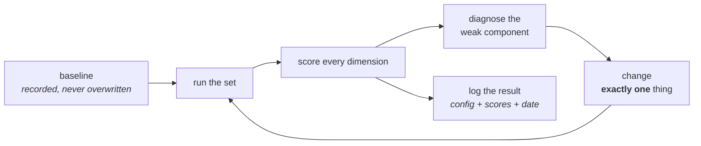

# Evaluation

How AI systems are measured, why measurement is a separate discipline here, and
how a bad score becomes a specific fix.

Conventional software is tested: a case passes or it fails. An AI system is
*evaluated*: it is right 87% of the time, and the interesting question is which
13% and why. Nothing else about delivering these systems changes as much as that
one difference.

The practical consequence is that **evaluation capability is built before the
system it evaluates**, and every subsequent change carries a before-and-after
number. Teams that skip this cannot tell improvement from regression, cannot
defend a quality claim, and cannot safely change a prompt.

---

## The two questions

| | Offline evaluation | Online measurement |
|---|---|---|
| **Question** | Is the system correct? | Is the system useful? |
| **Against** | A fixed golden dataset | Live traffic and real users |
| **Runs** | On every change, in the pipeline | Continuously in production |
| **Measures** | Accuracy, groundedness, retrieval quality, format, refusal | Adoption, task time, escalation rate, satisfaction, cost |
| **Available from** | Stage 3 | Stage 8 |

Both are required. A system can score well offline and be ignored by users; it
can be adopted enthusiastically and be quietly wrong. Offline evaluation steers
the build. Online measurement decides whether the build mattered.

---

## The golden dataset

The most valuable artifact produced in an AI delivery, and the one most often
skipped because it produces nothing demonstrable.

**Definition.** A fixed set of representative inputs paired with expert-approved
ideal outputs, maintained by the team, re-run against every change.

### Construction

| Property | Guidance |
|---|---|
| **Size** | 50 items is enough to steer by. 200–500 is a credible enterprise set. Coverage beats volume. |
| **Source** | Real user queries wherever they exist — support logs, search logs, ticket histories. Engineer-invented questions are biased toward what the system handles well. |
| **Authorship of answers** | The domain expert, not the builder. This is the reason a domain expert is named at Stage 0. |
| **Storage** | In the repository beside the code, changed by pull request, so a change to the evaluation target is as visible as a change to the code. |
| **Growth** | Every production failure becomes an entry. The set is a living record of everything the system has ever got wrong. |

### Composition — deliberately stratified

A set drawn only from common questions produces a system tuned for the easy
majority and blind to everything that matters.

- **Common** — the high-volume questions, in the phrasing users actually use.
- **Rare but critical** — infrequent, expensive to get wrong.
- **Multi-part** — requiring information from more than one source, which is
  where naive retrieval fails first.
- **Unanswerable** — questions whose answers are genuinely absent from the
  corpus. **The correct output is a refusal.** Without these, a system that never
  says "I don't know" scores perfectly and fabricates on everything outside the
  set.
- **Out of scope** — questions the system should decline (regulated advice,
  another department's domain).
- **Ambiguous** — where the correct behaviour is to ask a clarifying question.
- **Adversarial** — prompt injection attempts, attempts to extract the system
  instructions, attempts to induce policy violation.
- **Near-duplicates with different answers** — the case that exposes retrieval
  precision problems.

### Splitting

Hold a slice out and do not look at it while tuning. Iterating against the full
set produces configurations tuned to that set, and the resulting scores overstate
real performance in exactly the way that gets discovered during a pilot.

---

## Dimensions, and what each one diagnoses

Evaluation is decomposed rather than aggregated, because each dimension points at
a different component. A single overall accuracy number is a summary, not an
evaluation — it cannot generate a fix.

### For grounded question answering

| Dimension | Asks | A low score means |
|---|---|---|
| **Faithfulness / groundedness** | Is every claim in the answer supported by the retrieved material? | Generation problem — prompt, grounding instruction, or model tier. **The hallucination detector.** |
| **Answer relevance** | Does the answer address the question asked? | Prompt or task-framing problem. |
| **Context recall** | Did retrieval find the material needed to answer? | Retrieval problem — segmentation, search strategy, query phrasing. |
| **Context precision** | Is the retrieved set free of irrelevant material, best first? | Ranking problem — add re-ranking, filter by metadata, reduce top-k. |
| **Citation accuracy** | Do the cited sources actually contain the claim? | Attribution problem — frequently the most damaging in regulated settings, because the answer looks verified and is not. |
| **Refusal correctness** | Does it decline when it should, and only then? | Either over-refusal (unusable) or under-refusal (dangerous). Both matter. |

The diagnostic chain is worth memorising because it is the difference between
"quality is bad" and a work item: **low faithfulness → generation; low recall →
retrieval; low precision → ranking.**

### For agents and multi-step systems

| Dimension | Asks |
|---|---|
| **Task completion** | Did it finish the job? The only dimension that matters to the user. |
| **Tool selection accuracy** | Did it choose the right tool at each step? |
| **Argument correctness** | Were the arguments well-formed and correct? |
| **Step efficiency** | Steps taken versus the minimum needed. Drives both cost and latency. |
| **Recovery** | When a tool failed, did it recover sensibly or loop? |
| **Safety** | Did it stay inside its permitted actions under adversarial input? |

### For classification and extraction

Precision and recall, separately and always, because the trade-off between them
is a **product decision rather than a technical one**. High recall means catching
everything at the cost of false alarms; high precision means never crying wolf at
the cost of misses. Which one matters depends entirely on the consequence of each
error type, and stating that explicitly is a mark of seniority. F1 combines them
into one number, which is convenient and hides the decision.

### Non-functional, evaluated as rigorously

Latency at p50 and p95 (p95 is what users describe as "slow"), cost per request,
token consumption per request, and throughput under concurrency. These belong in
the same report as quality, because a system that is accurate and unaffordable
has not passed.

---

## Scoring methods

| Method | Use for | Strengths | Weaknesses |
|---|---|---|---|
| **Exact / fuzzy match** | Extraction, classification, structured fields | Cheap, deterministic, trustworthy | Only works where one right answer exists |
| **Schema validation** | Any structured output | Binary and unambiguous | Says nothing about content |
| **Retrieval metrics** | Search quality | Isolates retrieval from generation cleanly | Requires labelled relevant documents |
| **Model-as-judge** | Open-ended text quality | Scales; the industry default for free-text | Imprecise; biased toward verbosity and its own style; needs calibration against human labels |
| **Human review** | Ground truth, calibration, high-stakes | The actual standard | Slow and expensive |

**Model-as-judge, used properly.** A strong model grades outputs against explicit
criteria. It is imperfect and it is the only method that scales to open-ended
text. Making it trustworthy requires: a rubric specific enough that two people
would agree on the score, few-shot examples of each score level, deterministic
settings, a requirement to cite evidence for the score, and — the step usually
skipped — **calibration against a human-labelled subset**, so the judge's
agreement rate with humans is a known number rather than an assumption. An
uncalibrated judge is a random number generator with good manners.

---

## The iteration loop

**Rules that make the loop actually work:**

- **One variable per iteration.** Segmentation, retrieval strategy, prompt, model,
  and re-ranking all interact. Change three, observe an improvement, and nothing
  has been learned about which to keep.
- **Every run logged** with its configuration, its scores, and the date. The log
  is what allows a configuration to be defended six months later, and what
  prevents rediscovering the same dead end twice.
- **The baseline is never overwritten.** Cumulative improvement is the number that
  goes in front of a sponsor.
- **Segment the results.** An 85% average that fails systematically on the 15% of
  queries that matter most is worse than 80% distributed evenly. Report by query
  category, not just overall.
- **Read the failures.** Error analysis — sitting with fifty failed cases and
  categorising them — produces better decisions per hour invested than any other
  activity in this stage. Metrics say quality is bad; reading failures says *why*.

---

## Evaluation in the pipeline

Once the harness exists, it becomes a deployment gate:

1. A change is proposed — code, prompt, model, or configuration.
2. The golden set runs automatically.
3. Results are compared against the current production baseline.
4. Regression beyond a threshold on any dimension fails the build.
5. Passing results are recorded and the change proceeds.

This is what makes a prompt change safe. Without it, prompts are the highest-risk
uncontrolled surface in the system: trivially editable, globally impactful, and
untested.

---

## Production monitoring

Offline evaluation stops being sufficient the moment real traffic arrives.

**Tracing.** Every request produces a trace decomposed into spans — retrieval,
each tool call, each model call — with inputs, outputs, latency, and token cost
per span. When a system does something inexplicable, the workflow is: open the
trace, find the span where reality diverged from intent, fix that component.
Without tracing, debugging a multi-step AI system is guesswork.

**Continuous evaluation.** The golden set runs on a schedule, not only on
deployment, because these systems degrade without anyone changing anything:

| Drift | Cause | Detection |
|---|---|---|
| Corpus drift | Documents added, revised, removed | Scheduled evaluation; index freshness monitoring |
| Query drift | Users bring new questions | Distribution monitoring against the golden set's coverage |
| Model drift | Provider updates a model behind a stable name | Scheduled evaluation; pinned versions where available |
| Dependency drift | An upstream API changes shape | Tool error-rate alerting |

**Online signals worth instrumenting from day one:** explicit feedback
(thumbs), implicit feedback (was the answer copied, edited, or discarded),
escalation and override rate, session abandonment, repeated rephrasing of the
same question — a strong indicator of a failed answer that no thumbs-down was
left on — and per-query cost.

**The feedback loop that makes the system improve:** every negative signal is
triaged, categorised, and — where it represents a real failure — added to the
golden set with an expert-authored correct answer. That is the mechanism by
which a system gets better over time rather than merely staying alive. Building
the capture path for it is Stage 8 work and pays for the remainder of the
system's life.

---

## Reporting

The format that survives contact with stakeholders.

**Headline** — one sentence, against the target:
> Faithfulness improved from 0.71 to 0.89 against a 0.85 target, with retrieval
> recall at 0.92. Median latency 1.4s, p95 3.1s. Cost $0.011 per query.

**Comparison table** — one row per configuration, one column per dimension,
baseline first, so the reader sees the trajectory rather than a snapshot.

**What changed and why** — the specific intervention behind each movement.

**Known failure modes with frequency** — "table-heavy technical manuals retrieve
poorly; affects roughly 8% of queries; cause is extraction of merged cells; fix
estimated at one week." Naming limitations with numbers and a plan builds more
confidence than a clean report, because every experienced stakeholder knows a
clean report is incomplete.

**What is not measured** — stated explicitly. An honest gap is a manageable risk;
a hidden one is a future incident.
