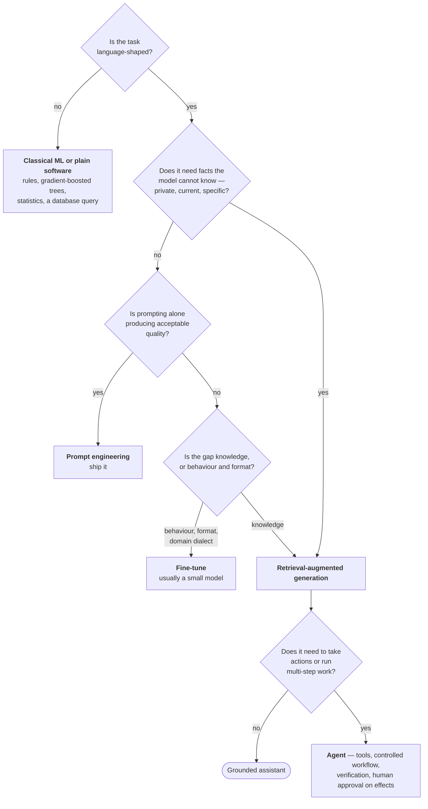

# Solution Patterns

The architecture decision layer of an AI delivery: what to build once the
problem is understood. Each pattern is described by the gap it closes, when it
is the right answer, when it is the wrong one, and what it costs.

---

## The four gaps

A language model, on its own, has exactly four limitations. Every technique in
applied AI addresses one of them, and asking *which gap does this close?* is the
fastest way to place an unfamiliar term.

| Gap | Consequence | Closed by |
|---|---|---|
| It optimises plausibility, not truth | fabricates confidently | grounding (retrieval), guardrails, evaluation |
| Knowledge frozen at a training cutoff | stale facts | retrieval, live tools |
| Knows nothing private | useless on internal material | retrieval |
| Can only produce text, never act | cannot complete work | tools and agents |

Hallucination is not a defect to be patched out. It follows directly from how
these models work — they generate the most plausible continuation, and
plausibility and truth diverge. Systems are engineered around it rather than
waiting for it to be solved.

---

## The decision



Patterns compose. A production copilot is typically an agent whose tools include
a retriever, behind a streaming interface, wrapped in guardrails, with a
fine-tuned classifier doing routing. The diagram selects the *core*, not the
whole.

---

## Prompt engineering

**Closes:** behaviour, format, task framing.
**Cost:** near zero. **Time to value:** minutes.

Always attempted first, because it is free and instant, and because a
surprisingly large share of quality problems are prompt problems.

The techniques with evidence behind them:

- **Explicit structure** — role, task, constraints, output format, stated
  separately rather than as a paragraph.
- **Delimited injected content** — retrieved documents, user data, and tool
  results wrapped in explicit markers. This is a correctness measure and a
  security measure: it is the boundary between instruction and data.
- **Few-shot examples** — two to five input/output demonstrations. More effective
  than prose instruction for format compliance, and the fastest fix for
  inconsistent output shape.
- **Explicit reasoning** — instructing the model to work through the problem
  before answering measurably improves accuracy on multi-step tasks, at the cost
  of tokens and latency.
- **Grounding with an escape hatch** — *"answer only from the provided context;
  if it is not there, say so."* The single most valuable sentence in a
  retrieval-grounded prompt, and the difference between a system that admits
  ignorance and one that invents.
- **Decomposition** — one prompt asked to do five things does all five poorly.
  Five steps each doing one thing, composed into a workflow, is both more
  accurate and vastly easier to debug.

**Prompts are source code.** Versioned, reviewed, and tested against the golden
set. A prompt change is a behaviour change to a production system.

**Structured output** deserves its own note, because parsing failures are a
leading cause of production incidents. In increasing order of reliability:
asking for JSON in the prompt, schema-enforced function/tool calling, a
provider's structured-output mode, and — on top of any of them — validating
against a typed schema with a retry on failure. Production systems use the last.

---

## Retrieval-augmented generation

**Closes:** private knowledge, current knowledge, fabrication.
**Cost:** moderate build, low per-query. **Time to value:** weeks.

At question time, find the small number of relevant passages from a document
collection, place only those in the prompt, and instruct the model to answer
from them alone. The model becomes an open-book reader rather than a recaller.

```
Ingestion  (offline, repeatable)
  sources → extract → segment → embed → index (+ metadata)

Query  (live, per request)
  question → embed → search → re-rank → assemble prompt → generate → cite
```

### The stages, and what each one costs when done badly

**Extract.** Source formats to clean text. Unglamorous and consistently the
largest time sink. Scanned documents need OCR or a vision model; tables lose
meaning under naive extraction; headers and footers inject noise into every
segment. Bad extraction is unrecoverable downstream — nothing later in the
pipeline can retrieve information that was destroyed here.

**Segment.** Split into retrievable units, small enough to be precise and large
enough to stand alone, with overlap so a decisive sentence is not severed at a
boundary. Splitting on natural structure — sections, then paragraphs, then
sentences — beats fixed-width splitting. **This is the highest-leverage tuning
parameter in the whole stack** and should be exhausted before anything more
elaborate is attempted.

**Metadata.** Source, section, date, department, sensitivity, access group,
attached to every unit. Enables citation, filtering, freshness rules, and
permission-aware retrieval. Omitting it means re-indexing the entire corpus
later.

**Embed.** Each unit becomes a vector encoding its meaning, so that text with
similar meaning lands nearby even with no shared words. One hard rule: queries
and documents must be embedded with the same model, since different models
produce incomparable spaces. Changing the embedding model means re-embedding
everything.

**Index.** A store optimised for nearest-neighbour search. The realistic options
differ mainly in operational burden: an embedded local store for prototypes; a
managed vector service for production; a vector extension on the relational
database the organisation already runs, which is often the correct enterprise
answer because it keeps business data and vectors in one system with one backup
and one access model; or the cloud provider's managed search service, which is
what most enterprise stacks land on because it is already approved.

**Search.** Pure semantic similarity has a specific, predictable failure: it
finds meaning and fumbles exact tokens. A query for a part number or an error
code returns thematically related prose rather than the passage containing that
literal string. **Hybrid search** runs semantic and keyword retrieval in parallel
and merges the two rankings, so a result ranked well by both rises to the top.
This is usually the second-largest quality improvement available, after
segmentation.

**Re-rank.** Two-stage retrieval: over-fetch cheaply with the index, then
re-score the candidates with a slower model that reads the query and each
candidate together, and keep the best few. Analogous to screening many
applications quickly and then reading the shortlist properly. It also mitigates
position sensitivity — models attend most strongly to the beginning and end of
long context, so putting the strongest evidence first changes the answer.

**Generate and cite.** Assemble the grounded prompt, generate, and return
citations with the answer. Citations are not decoration; they are the mechanism
by which a user can verify, and by which an auditor can accept the system at all.

### Common misconceptions

- Retrieval does not train or modify the model. Every request is independent.
- More retrieved passages is not better. Irrelevant context actively degrades the
  answer.
- Long context windows do not remove the need for retrieval. Attention over very
  large contexts is expensive and degrades in the middle, and retrieval remains
  cheaper and more precise at enterprise document scale.

### Beyond the basics

- **Iterative retrieval** — after retrieving, a check asks whether the retrieved
  material can actually answer the question; if not, the query is rewritten and
  retrieval runs again. Robust on multi-part questions, at the cost of latency.
- **Context compression** — reduce retrieved text to the relevant sentences
  before the final call, saving tokens and reducing noise.
- **Graph-based retrieval** — extract entities and relationships into a knowledge
  graph and retrieve by traversal. Wins on multi-hop questions of the form
  "which downstream contracts are affected by this change", and produces a
  traceable reasoning path, which regulated industries value.

---

## Agents

**Closes:** inability to act.
**Cost:** high build, high operational care. **Time to value:** weeks to months.

An assistant answers; an agent does. The mechanism is tool calling:

1. Functions are described to the model as schemas — name, purpose, parameters.
2. Instead of answering, the model emits a structured request naming a function
   and its arguments.
3. **The application code executes it.** The model never runs anything.
4. The result is returned into the conversation.
5. The model answers, or requests another tool.

The proposal/execution split is the entire foundation, and it is where
responsibility sits. A model cannot be instructed into safety. If a tool can
delete, something will eventually call it, and the only real control is that the
tool does not exist or the permission is not granted.

### Design principles

- **Tools are contracts.** A strict schema, documented semantics, predictable
  failure modes. The description is the model's only manual for the tool; a vague
  one produces misuse. This is why tool documentation quality directly affects
  system accuracy.
- **Errors are structured.** A failing tool returns a machine-readable reason —
  `invalid_date_format, expected YYYY-MM-DD` — that the model can act on, not a
  stack trace it will paraphrase into a confident lie.
- **Least privilege, enforced in code.** Read-only wherever possible. Write
  operations behind an allow-list. Destructive or outward-facing operations
  behind human approval.
- **Bounded loops.** Maximum steps, maximum cost, maximum wall-clock, with a
  defined behaviour on exhaustion. Unbounded agent loops are a real and expensive
  production failure.
- **Durable state.** Long-running work must survive a restart, and approval steps
  require the workflow to pause and resume. This makes persistent workflow state
  an architectural requirement rather than an optimisation.
- **Verification before returning.** Schema validation, citation checks, or a
  grading step, applied to the output before the user sees it.

### Control-flow patterns

| Pattern | Shape | Use |
|---|---|---|
| **Linear chain** | fixed sequence of steps | predictable transformation work |
| **Reason–act loop** | reason → call tool → observe → repeat | open-ended tasks; the written reasoning trail is what makes failures debuggable |
| **Plan then execute** | plan all steps, then run them | long, predictable tasks; cheaper and more auditable than replanning each step |
| **Router** | classify the request, dispatch to a specialist | mixed workloads; also a strong cost lever |
| **State machine / graph** | explicit nodes, edges, and conditional transitions | production systems needing loops, branches, retries, resumability, and per-step observability |
| **Supervisor multi-agent** | a coordinator decomposes work across specialist workers | tasks spanning genuinely different skills |

The progression from a linear chain to an explicit graph is the single most
important architectural step in production agent work, for one reason:
**reliability comes from constraining the model's freedom inside a structure the
engineer controls.** A single ambitious prompt with fifteen tools is less
reliable, less debuggable, and less improvable than eight small steps with
explicit transitions between them, each individually observable and testable.

### Multi-agent

One generalist with many tools becomes confused; specialists coordinate better,
for the same reason organisations have departments. Real, but frequently
premature. A supervisor delegating to a researcher, an analyst, and a writer is
a legitimate architecture; three agents where a two-step function would do is
overhead with a fashionable name. The honest test: can each agent's job be
described in one sentence without mentioning the others?

### Tool integration standards

Historically every agent-to-system integration was bespoke glue, which scales as
the product of agents and tools. Emerging standards address this by having a
system expose its capabilities once, with discoverable schemas, so that any
compatible agent can use them — the same argument as a universal connector.
Enterprises are interested because their ticketing, CRM, and data systems get
wrapped once rather than per project. A parallel effort addresses agents
communicating with other agents across organisational boundaries. In short: one
standard connects agents to tools, the other connects agents to agents.

---

## Fine-tuning

**Closes:** behaviour, format, domain dialect, and the cost/privacy/latency
profile of inference.
**Cost:** moderate, front-loaded into dataset work. **Time to value:** weeks.

The decision rule, stated plainly:

- Need current or private **facts** → retrieval. Fine-tuning is a poor mechanism
  for injecting facts.
- Need a specific **behaviour, tone, structure, or domain vocabulary** →
  fine-tune.
- Need **cheap, fast, offline, or fully private** inference → fine-tune a small
  model.
- Always try prompting first.

**Fine-tuning shapes how a model behaves, not what it knows.** That single
sentence resolves most of the confusion around this topic.

### Small models

Models in the roughly half-billion to eight-billion parameter range run on a
single modest GPU, a laptop, or capable edge hardware. The enterprise argument:
a small model specialised on one narrow domain can match a very large general
model on that domain at a fraction of the cost, with no data leaving the
premises. That combination — cost and privacy — is what makes this attractive to
regulated clients, more than raw capability.

### Parameter-efficient adaptation

Updating every weight of a large model requires datacentre hardware. The
practical alternative freezes the base model and trains small adapter matrices
inserted into the attention layers — on the order of one percent of the
parameters. The output is a small adapter file loaded on top of an unchanged
base model, which means one base model can serve many specialisations by
swapping adapters. Combined with reduced-precision weights, this brings training
within reach of consumer hardware.

### The workflow, and where the work actually is

1. **Dataset.** Instruction/output pairs. Quality and domain specificity dominate
   quantity; a few hundred good examples is a genuine starting point. Split into
   training and held-out validation. **In practice this is most of the job** —
   sourcing, cleaning, and deduplicating examples from support transcripts,
   tickets, or documents.
2. **Train.** A supervised fine-tuning loop over the dataset. Largely a script.
3. **Benchmark.** The step that makes it engineering. Identical test inputs
   through the base model and the tuned model, compared on accuracy, format
   compliance, latency, and cost. **No benchmark, no claim.** A sentence of the
   form *"the base model answered 4 of 20 domain questions correctly; the tuned
   model answered 17, at the same latency and a twentieth of the cost"* is what
   makes the case; anything vaguer does not.

---

## Voice

**Closes:** interaction modality.
**Cost:** moderate. **The whole engineering problem is latency.**

Three systems in series: speech to text, then the language model, then text to
speech. The transcript is an ordinary prompt, so retrieval and agent patterns
plug in unchanged.

Run sequentially, the stages sum to roughly two and a half seconds of silence
after the user stops speaking, which reads as broken in conversation. The fix is
to **stream every stage and overlap them** — transcribe while the user is still
talking, detect the end of speech immediately rather than waiting out a timeout,
emit model tokens as they are generated, and begin speaking the first sentence
while the rest is still being written. Time to first audio drops from around two
seconds to a few hundred milliseconds. Total work is unchanged; perceived
responsiveness is transformed.

Additional production requirements: **interruption handling** — users talk over
the system, and it must detect that and stop speaking instantly — and, in
multi-speaker settings, attributing speech to speakers. Accuracy is dominated by
audio conditions more than by model choice, so background noise is a design
constraint rather than an afterthought.

---

## When not to use a language model

Senior judgement in this field is as much about declining as about building.

| Situation | Better tool |
|---|---|
| Prediction over tabular, transactional, or sensor data | Gradient-boosted trees — usually more accurate and orders of magnitude cheaper |
| Deterministic rules with known logic | Ordinary code. It is testable, instant, free, and always right |
| Exact lookup or aggregation | A database query |
| Simple classification with abundant labels | A small supervised classifier |
| Arithmetic and numerical computation | A calculator, invoked as a tool |
| Anomaly detection over numeric streams | Statistical baselines or purpose-built detectors |
| Anything where being wrong is unacceptable and no human reviews it | Do not automate it yet |

Language models are expensive, slow, and non-deterministic relative to the
alternatives. They earn their place where the input is genuinely unstructured
language and the flexibility is worth the cost. Recognising when it is not is
what distinguishes an engineer from an enthusiast.

---

## Cost and latency levers

Applicable across all patterns, ordered by typical impact.

| Lever | Mechanism | Trade-off |
|---|---|---|
| **Model routing** | Classify the request; send easy ones to a small cheap model, hard ones to the expensive one | Routing errors; needs its own evaluation |
| **Semantic caching** | Serve near-duplicate questions from a cache keyed by meaning | Staleness; cache invalidation on corpus change |
| **Streaming** | Emit output as generated | None for perceived latency; total time unchanged |
| **Context compression** | Reduce retrieved material before the final call | Risk of removing something needed |
| **Smaller top-k** | Retrieve fewer passages | Recall loss if cut too far |
| **Batching** | Group non-interactive work | Not available for interactive paths |
| **Self-hosted small model** | Run a specialised model on owned infrastructure | Operational burden; only viable at volume |

Two habits matter more than any individual lever: **measure at p95 rather than
average**, because the tail is what users experience as "it's slow", and
**express cost per transaction**, because that is the only form in which it can
be compared against the value of the transaction.
